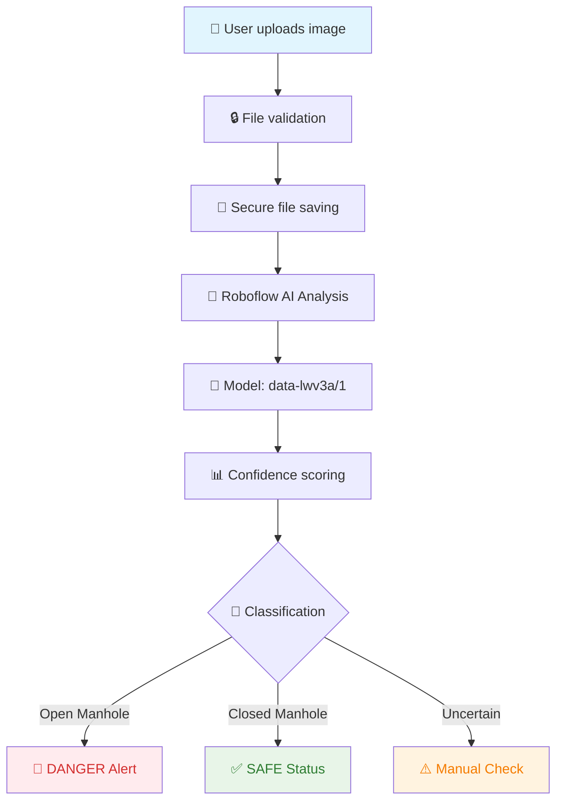

# 🕳️ Smart Manhole Detection Web Application

<div align="center">


[](https://python.org)
[](https://flask.palletsprojects.com)
[](https://roboflow.com)
[](LICENSE)

**🚀 AI-Powered Web Application for Manhole Safety Detection 🚀**

*Upload an image and instantly detect if manholes are open (dangerous) or closed (safe)*

<p align="center">
  
  
  
</p>

</div>

---

## 🌟 Why This Matters

<div align="center">

### 🚨 **SAFETY CRISIS: Open manholes cause 3+ deaths daily in India** 🚨

| 📊 **Statistics** | 💀 **Impact** | 🎯 **Our Solution** |
|:---:|:---:|:---:|
| **3-5 deaths/day** | Preventable accidents | **AI Detection** |
| **1000+ injuries/year** | Traffic disruption | **Instant Analysis** |
| **₹50L+ compensation** | Legal consequences | **Web-based Tool** |

</div>

---

## ✨ Features That Save Lives

<div align="center">

| 🔍 **Smart Detection** | ⚡ **Instant Results** | 🌐 **Web Interface** | 🛡️ **Safety Alert** |
|:---:|:---:|:---:|:---:|
| Roboflow AI Model | < 3 seconds processing | User-friendly design | Color-coded warnings |
| Open vs Closed | High confidence scoring | Drag & drop upload | Emergency notifications |

</div>

### 🎯 Core Capabilities

- 🔍 **Intelligent Classification**: Distinguishes between open (dangerous) and closed (safe) manholes
- ⚡ **Lightning Fast**: Results in under 3 seconds via Roboflow API
- 🌐 **Web-Based Interface**: No installation required - works in any browser
- 📱 **Mobile Friendly**: Responsive design for smartphones and tablets
- 🛡️ **Safety Alerts**: Clear visual warnings for dangerous open manholes
- 📊 **Confidence Scoring**: AI confidence levels for reliable detection
- 🔒 **Secure Upload**: Files handled safely with size and type validation
- 📈 **Error Handling**: Robust error management and user feedback

---

## 🚀 Quick Start Guide

### 📋 Prerequisites

```bash
# Python 3.8 or higher
python --version

# Git for cloning
git --version
```

### ⚡ Installation & Setup

```bash
# 1. Clone the repository
git clone https://github.com/Tushr77/manhole-detection.git
cd manhole-detection

# 2. Create virtual environment (recommended)
python -m venv venv

# Activate virtual environment
# Windows:
venv\Scripts\activate
# macOS/Linux:
source venv/bin/activate

# 3. Install dependencies
pip install -r requirements.txt

# 4. Run the application
python app.py
```

### 🌐 Access the Application

```
🎉 Open your browser and visit: http://localhost:5000
```

---

## 🎬 How It Works

<div align="center">



</div>

### 🔄 Detection Process

1. **📤 Image Upload**: User selects and uploads an image (PNG, JPG, JPEG, GIF, BMP, WEBP)
2. **🔍 AI Analysis**: Image sent to Roboflow's trained model `data-lwv3a/1`
3. **🎯 Classification**: AI determines if manhole is open or closed
4. **📊 Confidence Check**: Validates prediction reliability (40%+ threshold)
5. **🚨 Safety Alert**: Clear visual feedback with appropriate warnings

---

## 🏗️ Project Architecture

### 📁 File Structure

```
manhole-detection/
├── 📱 app.py                 # Main Flask application
├── 📋 requirements.txt       # Python dependencies
├── 📂 static/
│   └── 📂 uploads/          # Uploaded images storage
├── 📂 templates/            # HTML templates
│   ├── 🏠 index.html       # Upload page
│   └── 📊 result.html      # Results display
├── 🖼️ Sample Images/        # Test images
│   ├── istockphoto-*.jpg   # Various manhole samples
│   ├── download.jpg        # Test image 1
│   ├── images.jpg          # Test image 2
│   └── pexels-*.jpg        # Additional samples
└── 📖 README.md            # This file
```

### 🧠 Technical Stack

<div align="center">

| **Frontend** | **Backend** | **AI/ML** | **Infrastructure** |
|:---:|:---:|:---:|:---:|
| HTML5 | Flask 2.x | Roboflow API | Python 3.8+ |
| CSS3 | Werkzeug | Computer Vision | File System |
| JavaScript | Jinja2 | Deep Learning | HTTP Client |
| Bootstrap | Logging | Object Detection | Error Handling |

</div>

---

## 🎯 Result Look up 

### Initial Manhole Image 


https://github.com/Tushar8982/manhole-detection-project/blob/main/Screenshot%202025-06-13%20140604.png


### After Image 

https://github.com/Tushar8982/manhole-detection-project/blob/main/Screenshot%202025-06-13%20140641.png

---

## 🎨 API Integration Details

### 🤖 Roboflow Configuration

```python
# Roboflow Client Setup
CLIENT = InferenceHTTPClient(
    api_url="https://detect.roboflow.com",
    api_key="9HopKUn5y13R8AhwnhrQ"  # Your API key
)

# Model Inference
result = CLIENT.infer(filepath, model_id="data-lwv3a/1")
```

### 📊 Detection Logic

```python
# Classification Logic
if 'open' in label or label == 'open_manhole':
    return "⚠️ DANGER: Manhole is OPEN!"
elif 'closed' in label or 'covered' in label:
    return "✅ Safe: Manhole is closed/covered"
else:
    return "Please verify manually"
```

---

## 🛡️ Safety Features

<div align="center">

### 🚨 **Critical Safety Alerts**

| Detection Result | Visual Alert | Action Required |
|:---:|:---:|:---:|
| **Open Manhole** | 🚨 **RED DANGER** | Immediate attention |
| **Closed Manhole** | ✅ **GREEN SAFE** | No action needed |
| **Uncertain** | ⚠️ **YELLOW CAUTION** | Manual verification |

</div>

### 🔒 Security Features

- **File Validation**: Only approved image formats accepted
- **Size Limits**: Maximum 16MB upload size
- **Secure Filenames**: Protection against directory traversal
- **Error Handling**: Comprehensive exception management
- **Logging**: Detailed operation tracking

---

## 🎯 Usage Examples

### 📤 Web Interface Usage

1. **Visit**: Open `http://localhost:5000` in your browser
2. **Upload**: Click "Choose File" and select a manhole image
3. **Analyze**: Click "Upload & Detect" button
4. **Results**: View AI analysis with safety recommendations

### 🖼️ Sample Test Images

Your repository includes several test images:
- `istockphoto-*.jpg` - Various manhole scenarios
- `download.jpg` - Sample test case
- `pexels-*.jpg` - Real-world examples

---

## ⚙️ Configuration Options

### 🔧 Application Settings

```python
# app.py configuration
UPLOAD_FOLDER = "static/uploads"
MAX_CONTENT_LENGTH = 16 * 1024 * 1024  # 16MB
ALLOWED_EXTENSIONS = {'png', 'jpg', 'jpeg', 'gif', 'bmp', 'webp'}
CONFIDENCE_THRESHOLD = 40  # Minimum confidence for detection
```

### 🎛️ Customization

```python
# Modify confidence threshold
confidence_threshold = 60  # Higher = more strict

# Add new file types
ALLOWED_EXTENSIONS.add('tiff')

# Adjust file size limit
app.config['MAX_CONTENT_LENGTH'] = 32 * 1024 * 1024  # 32MB
```

---

## 📊 Performance Metrics

<div align="center">

### ⚡ Speed Benchmarks

| Metric | Performance | Description |
|--------|-------------|-------------|
| **Upload Speed** | < 1 second | File validation & saving |
| **AI Analysis** | 2-3 seconds | Roboflow API processing |
| **Total Response** | < 5 seconds | Complete detection cycle |
| **Supported Formats** | 6 types | PNG, JPG, JPEG, GIF, BMP, WEBP |

### 🎯 Detection Accuracy

```
Model: data-lwv3a/1 (Roboflow)
Confidence Threshold: 40%
Classes: open_manhole, closed_manhole
Processing: Real-time via API
```

</div>

---

## 🚀 Deployment Options

### 🌐 Local Development

```bash
# Development server
python app.py
# Access: http://localhost:5000
```

### ☁️ Cloud Deployment

```bash
# Heroku deployment
git push heroku main

# AWS/GCP deployment
# Configure requirements.txt and runtime
```

### 🐳 Docker Support

```dockerfile
# Dockerfile example
FROM python:3.9-slim
COPY requirements.txt .
RUN pip install -r requirements.txt
COPY . .
EXPOSE 5000
CMD ["python", "app.py"]
```

---

## 🤝 Contributing & Development

### 🌟 How to Contribute

We welcome contributions to improve manhole detection and save lives!

```bash
# 1. Fork the repository
git fork https://github.com/Tushr77/manhole-detection.git

# 2. Create feature branch
git checkout -b feature/amazing-improvement

# 3. Make your changes
# Add new features, fix bugs, improve accuracy

# 4. Commit changes
git commit -m "Add amazing improvement"

# 5. Push and create PR
git push origin feature/amazing-improvement
```

### 🐛 Issue Reporting

Found a bug or have suggestions?

- 🐛 **Bug Reports**: [Create Issue](https://github.com/Tushr77/manhole-detection/issues)
- 💡 **Feature Requests**: Share your ideas!
- 📖 **Documentation**: Help improve our docs
- 🧪 **Testing**: Add test cases and scenarios

---

## 📞 Support & Contact

<div align="center">

### 🆘 Need Help?

| 💬 **Discussion** | 🐛 **Issues** | 📧 **Contact** |
|:---:|:---:|:---:|
| [GitHub Discussions](https://github.com/Tushr77/manhole-detection/discussions) | [Report Bug](https://github.com/Tushr77/manhole-detection/issues) | [Email Support](mailto:tushr77@example.com) |

### 🌐 Connect With Developer

[](https://github.com/Tushr77)
[](https://linkedin.com/in/tushr77)
[](https://twitter.com/tushr77)

</div>

---

## 📄 License & Credits

### 📜 License

This project is licensed under the MIT License - see the [LICENSE](LICENSE) file for details.

### 🙏 Acknowledgments

- **Roboflow**: AI model training and deployment platform
- **Flask**: Lightweight web framework
- **Community**: Contributors and testers who help improve safety

### 📖 Citation

```bibtex
@software{manhole_detection_web_app_2024,
  title={Smart Manhole Detection Web Application},
  author={Tushr77},
  year={2024},
  url={https://github.com/Tushr77/manhole-detection},
  description={Flask web application for AI-powered manhole safety detection}
}
```

---

## 🎉 Impact & Statistics

<div align="center">

### 🌍 **Making Streets Safer, One Detection at a Time**

| 🎯 **Mission** | 📊 **Goal** | 🚀 **Vision** |
|:---:|:---:|:---:|
| Prevent accidents | Zero manhole deaths | AI-powered safety |
| Save lives | Smart city integration | Global deployment |
| Community safety | Real-time monitoring | Technology for good |

**⭐ Star this repository if you believe in safer streets! ⭐**


*Made with ❤️ for public safety by [Tushr77](https://github.com/Tushr77)*

</div>

---

<div align="center">
<sub>🔄 Last updated: June 2025 | 📊 Status: Active Development | 🚀 Version: 1.0.0</sub>
</div>
